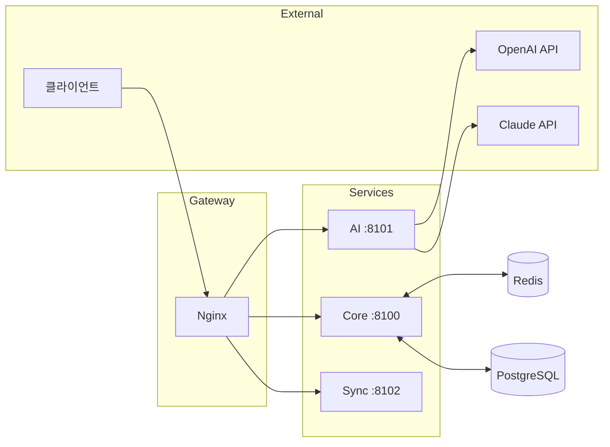

# 🏗️ Cowrite 기술 아키텍처 설계

> 종합 웹소설 창작 플랫폼의 시스템 아키텍처와 기술 스택을 정의합니다.

---

## 1. 시스템 개요

### 1.1 아키텍처 다이어그램

```
┌─────────────────────────────────────────────────────────────────┐
│                         클라이언트 레이어                         │
├─────────────┬─────────────┬─────────────┬─────────────────────────┤
│   Web App   │  Desktop    │   Mobile    │     VS Code Ext.        │
│  (Next.js)  │  (Electron) │(React Native)│     (Optional)         │
└──────┬──────┴──────┬──────┴──────┬──────┴──────────┬──────────────┘
       │             │             │                  │
       └─────────────┴──────┬──────┴──────────────────┘
                            │ HTTPS/WSS
                            ▼
┌─────────────────────────────────────────────────────────────────┐
│                      Nginx (리버스 프록시)                        │
│              Rate Limiting, SSL Termination                      │
└──────────────────────────────┬──────────────────────────────────┘
                               │
       ┌───────────────────────┼───────────────────────┐
       ▼                       ▼                       ▼
┌──────────────┐     ┌──────────────┐     ┌──────────────────────┐
│ Core API     │     │ AI Service   │     │   Sync Service       │
│  :8100       │     │  :8101       │     │   :8102              │
│ (Spring Boot)│     │  (FastAPI)   │     │ (Spring WebSocket)   │
└──────┬───────┘     └──────┬───────┘     └──────────┬───────────┘
       │                    │                        │
       │    ┌───────────────┼────────────────┐       │
       ▼    ▼               ▼                ▼       ▼
┌─────────────────────────────────────────────────────────────────┐
│                       데이터 레이어                              │
├─────────────────────┬───────────────────────────────────────────┤
│ PostgreSQL (직접설치)│     Redis (Docker)                        │
│     :5432           │       :6379                               │
└─────────────────────┴───────────────────────────────────────────┘
```

### 1.2 기술 스택 요약

| 레이어 | 기술 |
|--------|------|
| **Frontend** | Next.js 14, TypeScript, TailwindCSS |
| **Desktop** | Electron + React |
| **Mobile** | React Native / Expo |
| **Backend** | Java (Spring Boot) + Python (FastAPI) |
| **ORM** | Spring Data JPA (Hibernate) |
| **Database** | PostgreSQL 16 (직접 설치) |
| **Cache** | Redis 7 (Docker) |
| **AI/ML** | OpenAI API, Anthropic Claude, Whisper |
| **Infra** | Docker Compose |

---

## 2. 서비스 구성

### 2.1 서비스 목록

| 서비스 | 역할 | 기술 | 포트 |
|--------|------|------|------|
| **frontend** | 웹 클라이언트 | Next.js | **3100** |
| **core-api** | 핵심 비즈니스 로직 | Spring Boot | **8100** |
| **ai-service** | LLM 연동, AI 기능 | FastAPI | **8101** |
| **sync-service** | 실시간 협업, WebSocket | Spring WebSocket | **8102** |
| **redis** | 캐시, 세션, 큐 | Redis | 6379 |
| **nginx** | 리버스 프록시 | Nginx | 80, 443 |
| **postgresql** | 메인 DB | PostgreSQL | 5432 (직접 설치) |

### 2.2 서비스 간 통신



---

## 3. 보안 아키텍처

### 3.1 인증 플로우

```
┌──────────┐     ┌──────────┐     ┌──────────┐
│  Client  │────►│  Nginx   │────►│  Core    │
└──────────┘     └──────────┘     └────┬─────┘
                                       │
                      ┌────────────────┘
                      ▼
              ┌───────────────┐
              │ JWT 발급      │
              │ Access: 15분  │
              │ Refresh: 7일  │
              └───────────────┘
```

### 3.2 보안 레이어

| 레이어 | 구현 |
|--------|------|
| **전송** | TLS 1.3, HTTPS only |
| **인증** | JWT + Refresh Token, OAuth 2.0 |
| **인가** | RBAC (Role-Based Access Control) |
| **데이터** | AES-256 암호화 (at rest) |
| **API** | Rate Limiting, CORS |

---

## 4. 확장성 설계

### 4.1 수평 확장 (향후)

```
                    ┌─────────────┐
                    │ Load Balancer│
                    └──────┬──────┘
           ┌───────────────┼───────────────┐
           ▼               ▼               ▼
      ┌─────────┐    ┌─────────┐    ┌─────────┐
      │ Core #1 │    │ Core #2 │    │ Core #3 │
      └─────────┘    └─────────┘    └─────────┘
```

### 4.2 성능 목표

| 지표 | 목표 |
|------|------|
| API 응답 | P95 < 200ms |
| 동시 접속 | 1,000+ (초기) |
| 가용성 | 99.9% |

---

## 5. 데이터 흐름

### 5.1 집필 저장 플로우

```
1. 사용자 타이핑
      ▼
2. 디바운스 (500ms)
      ▼
3. 로컬 저장 (IndexedDB)
      ▼
4. 서버 동기화 (HTTP/WebSocket)
      ▼
5. PostgreSQL 저장
      ▼
6. 버전 히스토리 생성
```

### 5.2 AI 기능 플로우

```
1. 클라이언트 요청
      ▼
2. core-api (인증, 쿼터 체크)
      ▼
3. ai-service
      ▼
4. 컨텍스트 구성 (설정, 원고)
      ▼
5. LLM API 호출 (OpenAI/Claude)
      ▼
6. 응답 후처리
      ▼
7. 클라이언트 전송
```

---

*버전: 1.0 | 작성일: 2026년 1월*
