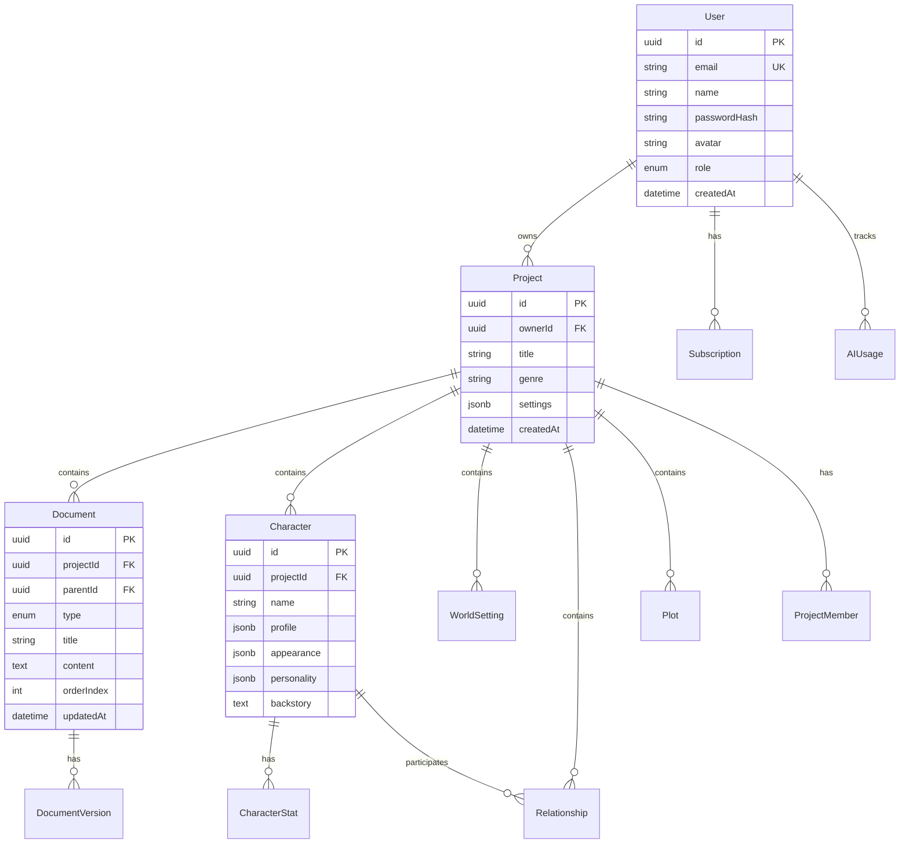

# 🗄️ Cowrite 데이터베이스 설계

> PostgreSQL 기반 데이터 모델과 스키마를 정의합니다.

**실제 적용 스키마는 `/database/schema.sql`을 기준으로 합니다.**

---

## 1. 기술 스택

| 구성 | 기술 |
|------|------|
| **Primary DB** | PostgreSQL 16 (직접 설치) |
| **ORM** | **TypeORM** |
| **Cache** | Redis 7 |

---

## 2. ERD (핵심 엔티티)



---

## 3. 테이블 스키마

### 3.1 Users (사용자)

```sql
CREATE TABLE users (
    id              UUID PRIMARY KEY DEFAULT gen_random_uuid(),
    email           VARCHAR(255) UNIQUE NOT NULL,
    name            VARCHAR(100) NOT NULL,
    password_hash   VARCHAR(255),
    avatar_url      VARCHAR(500),
    role            VARCHAR(20) DEFAULT 'user',
    oauth_provider  VARCHAR(20),
    oauth_id        VARCHAR(255),
    settings        JSONB DEFAULT '{}',
    created_at      TIMESTAMPTZ DEFAULT NOW(),
    updated_at      TIMESTAMPTZ DEFAULT NOW(),
    deleted_at      TIMESTAMPTZ
);

CREATE INDEX idx_users_email ON users(email);
CREATE INDEX idx_users_oauth ON users(oauth_provider, oauth_id);
```

### 3.2 Projects (프로젝트)

```sql
CREATE TABLE projects (
    id              UUID PRIMARY KEY DEFAULT gen_random_uuid(),
    owner_id        UUID NOT NULL REFERENCES users(id),
    title           VARCHAR(200) NOT NULL,
    description     TEXT,
    genre           VARCHAR(50),
    cover_url       VARCHAR(500),
    settings        JSONB DEFAULT '{}',
    word_count      INTEGER DEFAULT 0,
    is_public       BOOLEAN DEFAULT false,
    created_at      TIMESTAMPTZ DEFAULT NOW(),
    updated_at      TIMESTAMPTZ DEFAULT NOW(),
    deleted_at      TIMESTAMPTZ
);

CREATE INDEX idx_projects_owner ON projects(owner_id);
CREATE INDEX idx_projects_genre ON projects(genre);
```

### 3.3 Documents (원고)

```sql
CREATE TABLE documents (
    id              UUID PRIMARY KEY DEFAULT gen_random_uuid(),
    project_id      UUID NOT NULL REFERENCES projects(id),
    parent_id       UUID REFERENCES documents(id),
    type            VARCHAR(20) NOT NULL, -- 'series', 'part', 'chapter', 'scene'
    title           VARCHAR(200) NOT NULL,
    content         TEXT,
    order_index     INTEGER DEFAULT 0,
    word_count      INTEGER DEFAULT 0,
    status          VARCHAR(20) DEFAULT 'draft', -- 'draft', 'writing', 'done'
    notes           TEXT,
    created_at      TIMESTAMPTZ DEFAULT NOW(),
    updated_at      TIMESTAMPTZ DEFAULT NOW()
);

CREATE INDEX idx_documents_project ON documents(project_id);
CREATE INDEX idx_documents_parent ON documents(parent_id);
CREATE INDEX idx_documents_order ON documents(project_id, order_index);
```

### 3.4 Characters (캐릭터)

```sql
CREATE TABLE characters (
    id              UUID PRIMARY KEY DEFAULT gen_random_uuid(),
    project_id      UUID NOT NULL REFERENCES projects(id),
    name            VARCHAR(100) NOT NULL,
    role            VARCHAR(50), -- 'protagonist', 'antagonist', 'supporting'
    profile         JSONB DEFAULT '{}',
    appearance      JSONB DEFAULT '{}',
    personality     JSONB DEFAULT '{}',
    backstory       TEXT,
    speech_sample   TEXT,
    image_url       VARCHAR(500),
    created_at      TIMESTAMPTZ DEFAULT NOW(),
    updated_at      TIMESTAMPTZ DEFAULT NOW()
);

CREATE INDEX idx_characters_project ON characters(project_id);
```

### 3.5 CharacterStats (스탯)

```sql
CREATE TABLE character_stats (
    id              UUID PRIMARY KEY DEFAULT gen_random_uuid(),
    character_id    UUID NOT NULL REFERENCES characters(id),
    template_type   VARCHAR(50) NOT NULL, -- 'rpg', 'romance', 'custom'
    stats           JSONB NOT NULL,
    episode_num     INTEGER,
    created_at      TIMESTAMPTZ DEFAULT NOW()
);

CREATE INDEX idx_stats_character ON character_stats(character_id);
```

### 3.6 WorldSettings (세계관)

```sql
CREATE TABLE world_settings (
    id              UUID PRIMARY KEY DEFAULT gen_random_uuid(),
    project_id      UUID NOT NULL REFERENCES projects(id),
    parent_id       UUID REFERENCES world_settings(id),
    category        VARCHAR(50) NOT NULL, -- 'geography', 'history', 'society'
    title           VARCHAR(200) NOT NULL,
    content         TEXT,
    metadata        JSONB DEFAULT '{}',
    created_at      TIMESTAMPTZ DEFAULT NOW()
);

CREATE INDEX idx_world_project ON world_settings(project_id);
```

### 3.7 Relationships (관계도)

```sql
CREATE TABLE relationships (
    id              UUID PRIMARY KEY DEFAULT gen_random_uuid(),
    project_id      UUID NOT NULL REFERENCES projects(id),
    character_a_id  UUID NOT NULL REFERENCES characters(id),
    character_b_id  UUID NOT NULL REFERENCES characters(id),
    relation_type   VARCHAR(50) NOT NULL,
    description     TEXT,
    is_bidirectional BOOLEAN DEFAULT false,
    metadata        JSONB DEFAULT '{}',
    
    CONSTRAINT unique_relationship 
        UNIQUE(project_id, character_a_id, character_b_id, relation_type)
);
```

### 3.8 DocumentVersions (버전)

```sql
CREATE TABLE document_versions (
    id              UUID PRIMARY KEY DEFAULT gen_random_uuid(),
    document_id     UUID NOT NULL REFERENCES documents(id),
    content         TEXT NOT NULL,
    word_count      INTEGER,
    version_name    VARCHAR(100),
    created_by      UUID REFERENCES users(id),
    created_at      TIMESTAMPTZ DEFAULT NOW()
);

CREATE INDEX idx_versions_document ON document_versions(document_id);
```

### 3.9 AIUsage (AI 사용량)

```sql
CREATE TABLE ai_usage (
    id              UUID PRIMARY KEY DEFAULT gen_random_uuid(),
    user_id         UUID NOT NULL REFERENCES users(id),
    feature         VARCHAR(50) NOT NULL,
    tokens_used     INTEGER NOT NULL,
    model           VARCHAR(50),
    created_at      TIMESTAMPTZ DEFAULT NOW()
);

CREATE INDEX idx_ai_usage_user ON ai_usage(user_id, created_at);
```

---

## 4. JSONB 스키마

### 4.1 Character Profile

```json
{
  "basic": {
    "age": 25,
    "gender": "male",
    "occupation": "knight",
    "species": "human"
  },
  "mbti": "INTJ",
  "traits": ["brave", "stubborn"],
  "weaknesses": ["impatient"],
  "goals": ["save the kingdom"]
}
```

### 4.2 Character Stats (RPG)

```json
{
  "level": 27,
  "class": "swordsman",
  "stats": {
    "str": 89,
    "dex": 72,
    "int": 45,
    "hp": 156,
    "mp": 32
  },
  "skills": [
    {"name": "Slash", "level": 5},
    {"name": "Block", "level": 3}
  ]
}
```

### 4.3 Character Stats (Romance)

```json
{
  "affinity": {
    "prince": 45,
    "knight": 72,
    "wizard": 28
  },
  "reputation": 68,
  "wealth": 89
}
```

---

## 5. 인덱스 전략

| 테이블 | 인덱스 | 용도 |
|--------|--------|------|
| users | email | 로그인 조회 |
| projects | owner_id | 내 프로젝트 |
| documents | (project_id, order) | 정렬 조회 |
| characters | project_id | 캐릭터 목록 |
| document_versions | (doc_id, created_at) | 버전 히스토리 |

---

## 6. 백업 전략

| 구분 | 전략 |
|------|------|
| **자동 백업** | 일일 스냅샷 (30일 보관) |
| **증분 백업** | WAL 아카이빙 |
| **복구** | Point-in-Time Recovery |

---

## 7. TypeORM Entity 예시

```typescript
// entities/document.entity.ts
@Entity('documents')
export class Document {
  @PrimaryGeneratedColumn('uuid')
  id: string;

  @Column('uuid')
  projectId: string;

  @Column('uuid', { nullable: true })
  parentId: string;

  @Column({ length: 20 })
  type: 'series' | 'part' | 'chapter' | 'scene';

  @Column({ length: 200 })
  title: string;

  @Column('text', { nullable: true })
  content: string;

  @Column('int', { default: 0 })
  orderIndex: number;

  @ManyToOne(() => Project)
  @JoinColumn({ name: 'project_id' })
  project: Project;

  @OneToMany(() => DocumentVersion, v => v.document)
  versions: DocumentVersion[];
}
```

---

*버전: 1.0 | 작성일: 2026년 1월*
